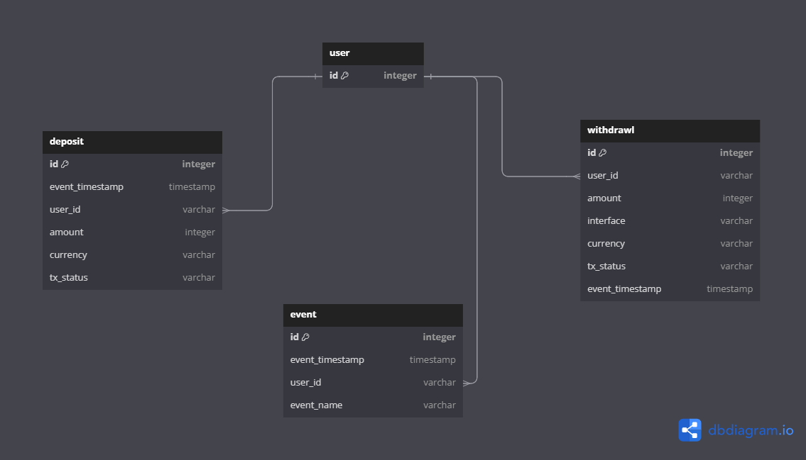
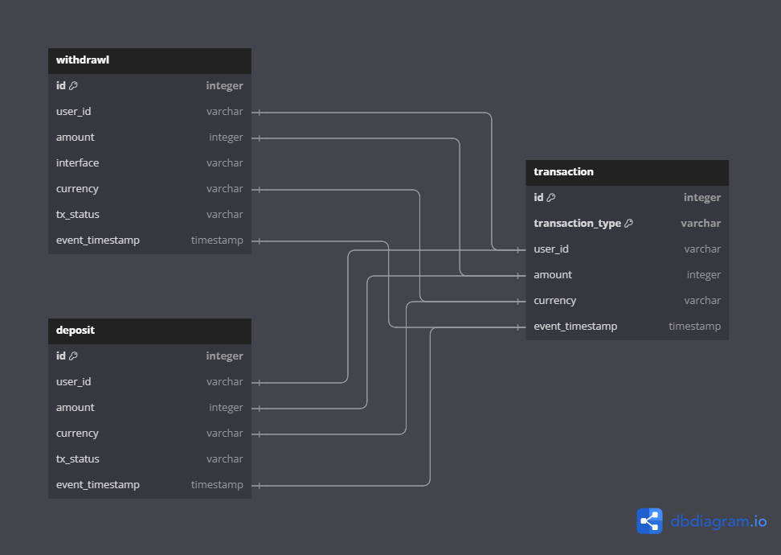
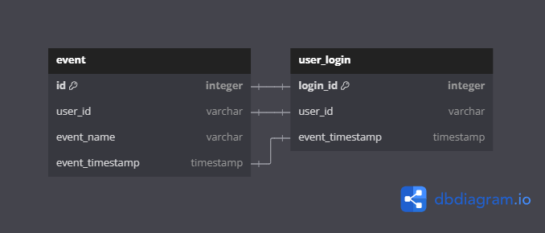

# README

To get started with the `de_challenge_2` project, follow these steps:

## Run Locally

1. Open a terminal and navigate to the project directory: `/home/ubuntu/de_challenge_2/`

2. Activate the project environment. Depending on your operating system, you can use either `venv` or `conda`:

   - For `venv`, run:
     ```
     python -m venv .venv
     ```
   - For `conda`, run:
     ```
     conda create -n de_challenge_2
     ```

3. Activate the project environment. Depending on your operating system, you can use either `venv` or `conda`:

   - For `venv`, run:
     ```
     source .venv/bin/activate
     ```
   - For `conda`, run:
     ```
     conda activate de_challenge_2
     ```

4. Install the project dependencies by running the following command:

   ```
   pip install -r requirements.txt
   ```

5. Rename the `.env.example` file to `.env` and update the environment variables as needed.

   - `PROCESS_ALL`: Set to `1` to process all data or `0` to process only new data.
   - `LOGS_LEVEL`: Set the logging level to `DEBUG` if you want to see detailed logs. Otherwise, set it to `INFO`.
   - `INPUT_DATA_PATH`: The path to the input data directory.
   - `OUTPUT_DATA_PATH`: The path to the output data directory.

6. Unzip the `deposit.zip` file located on the `data/input` directory.

7. Run the following command to execute the project:
   ```
   python app/main.py
   ```

## Run on Docker

1. Open a terminal and navigate to the project directory: `/home/ubuntu/de_challenge_2/`

2. Build the Docker image by running the following command:

   ```
   docker build -t de_challenge_2 .
   ```

3. Run the Docker container by executing the following command:

   ```
    docker run --env-file /home/ubuntu/de_challenge_2/.env -v /home/ubuntu/de_challenge_2/data:/app/data de_challenge_2
   ```

   Replace `/home/ubuntu/de_challenge_2/data` with the path to the data directory on your local machine.

## ERD

The Entity Relationship Diagram (ERD) for the `de_challenge_2` project is as follows:



## Lineage for output tables

The lineage for the output tables is as follows:

- `transaction` table is derived from the `deposit` and `withdrawal` tables.
  

- `user_login` table is derived from the `event` table.
  

## Data Modeling Techniques

1. **ETL Process**:

   - Extract: Reading data from `deposit.csv`, `withdrawl.csv`, and `event.csv` into DuckDB tables.
   - Transform: Processing and filtering data to create consolidated tables (`transaction` and `user_login`).
   - Load: Inserting processed data into new tables for analysis.

2. **Data Integration**: Combining multiple sources into unified tables to provide a comprehensive view of user activities for further analysis.

3. **Incremental Loading**: Efficiently processing only new data since the last run to optimize performance.

4. **Dedupe**: Removing duplicate records to ensure data integrity and consistency when running queries.

5. **Indexing and Partitioning**: Enhancing query performance by creating indexes on frequently queried columns and partitioning tables based on specific criteria.

## Indexing and Partitioning

### Transaction Table

Indexes:

- `transaction_type`
- `user_id`
- `currency`
- `transaction_id`
- `event_timestamp`

Partitioning:

- If we're using BigQuery we can partition by `event_timestamp` to optimize query performance.

### User Login Table

Indexes:

- `user_id`
- `login_id`

## Queries examples

- You can find queries to answer the questions in the challenge in the [queries](./queries/examples.md) directory.

## Assumptions

This process relies on the following assumptions:

- Latency is not a concern. If it were, we would need to consider a different approach to api calls.
